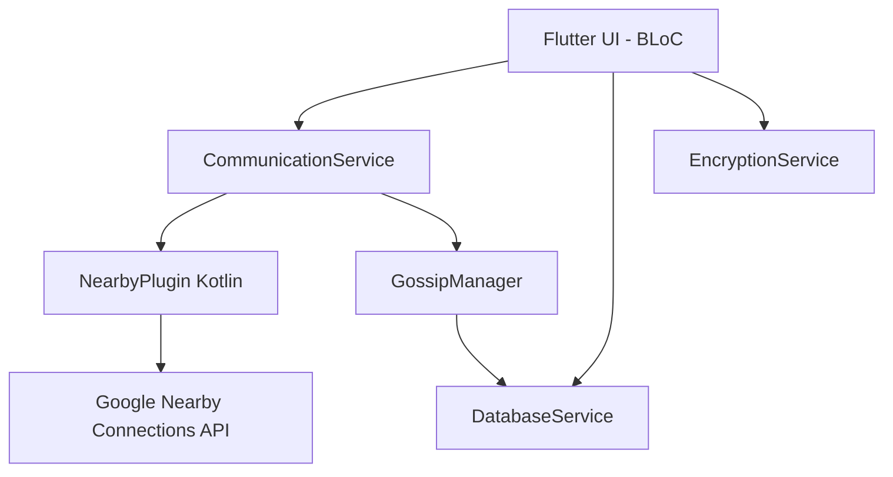
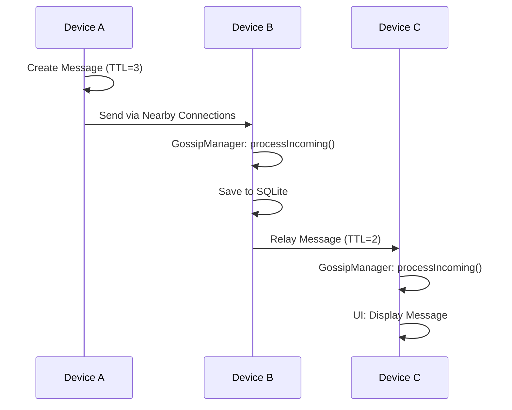

# Relivox

**Offline Peer-to-Peer Communication System for Zero-Network Environments**

Relivox is a decentralized, server-less mobile application designed for communication in scenarios where internet or cellular networks are unavailable (e.g., disasters, remote areas, network outages). It uses Google's Nearby Connections API to establish high-throughput P2P links and implement a multi-hop gossip protocol for message relaying.

## Features
- **Offline Messaging**: Send and receive messages without internet using Bluetooth, Wi-Fi Direct, and BLE.
- **Device Discovery**: See nearby users in real-time.
- **Multi-hop Relay (Gossip Protocol)**: Messages are automatically forwarded between devices to extend range.
- **Emergency Broadcast**: High-priority alert messages emphasized in the UI.
- **Local Persistence**: All messages and peer data are stored locally in a SQLite database.
- **E2EE Ready**: Built-in Ed25519 signing and X25519 key management framework.

## Architecture

### Component Diagram

### Sequence Diagram: Message Sending & Relay

## Setup & Installation

### Prerequisites
- Flutter SDK (>= 3.3.0)
- Android Studio / VS Code
- Physical Android Devices (Nearby Connections requires physical hardware for Bluetooth/Wi-Fi Direct)
- Android API Level 21+ (Target 33+)

### Build Instructions
1. Clone the repository into your Flutter workspace.
2. Run `flutter pub get`.
3. Connect your Android device.
4. Run `flutter run`.

### Permissions
The app requires the following permissions, handled at runtime:
- Bluetooth (Scan, Advertise, Connect)
- Location (Fine/Coarse) - required by Android for P2P discovery
- Nearby Wi-Fi Devices (API 33+)

## CI/CD
The project includes a GitHub Actions workflow `.github/workflows/android_ci.yml` for automated testing and APK building.

## Troubleshooting
- **Discovery Failure**: Ensure Bluetooth and Location are enabled on both devices.
- **Connection Issues**: Nearby Connections may fail if devices are too far apart or have interfering 2.4GHz signals.
- **Battery Optimization**: Some Android OEMs (Samsung, Huawei) may kill the app in the background. Disable battery optimization for Relivox for best results.
